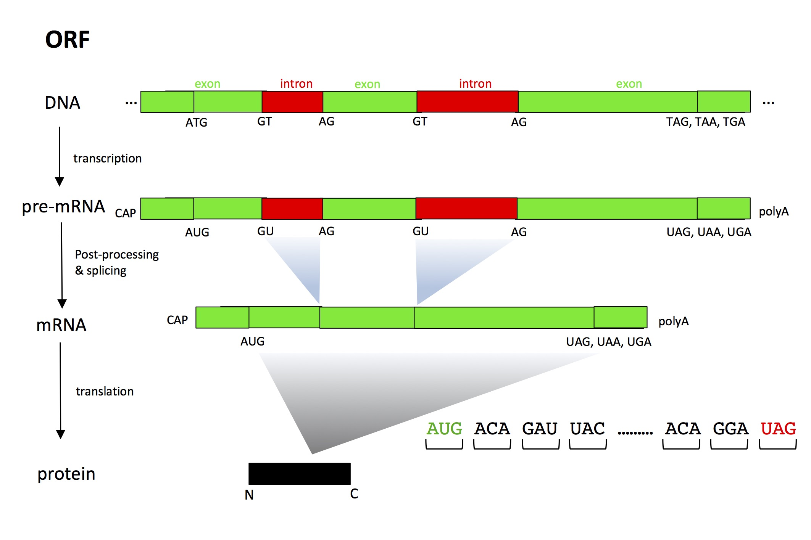

# Introduction
**Irisas** (Integrated region-based variant synchronization and Annotation for association studies)\
This pipeline includes two modules:\
    *synchronize INDEL and other variants for GWAS and population genomics analysis.\
    *generate variants tables of multiple variants integrating effect on ORF level for GWAS aim.
## Motivation
### INDEL
Gaps between the variance explained by identified SNP QTLs and estimated heritability suggested there are missing causal variants. It has been attracting a lot of attentions about how to uncover missing causal variants. We developed this pipeline to uncover causal INDEL and integrating effects of multiple variants.\
INDEL could cause phenotype diversity. The causal role of INDEL might could not be completely uncovered by SNPs, due to non-perfect linkage disequilibrium (LD). So performing association analysis, taking INDEL as independent variable, might could uncover novel causal variants.\
For NGS data analysis, when aligning a divergent sequence to a reference genome, alignment isomorphs usually occur, where the essentially same sequence could be aligned in different ways. It is very important to synchronize those INDELs to take them as independent variables for association analysis.
<p align="center">

</p>

### Integrating effect
The protein coding region of genome sequence would be translated into functional protein molecular through several key steps. Any mutation that alter the transcription and translation are generally result into no final protein product or loss of function protein product. This kind of mutation is suspected to cause phenotype diversity.
By integrating the effects of all variants in the gene region, we could predicat weather a gene could code functional protein. Taking this predication as independent variables, some causal genes could be uncovered.
<p align="center">

</p>

### Everything and Anything
You could go to our [wiki page](https://github.com/baoxingsong/Irisas/wiki) for more details about the underlying algorithm.


# Dependency
[imrdenom](http://chi.mpipz.mpg.de/download/imrdenom/)\
[wigToBigWig](https://genome.ucsc.edu/goldenpath/help/bigWig.html)\
[mafft](http://mafft.cbrc.jp/alignment/software/)\
[Exonerate](http://www.ebi.ac.uk/about/vertebrate-genomics/software/exonerate)\
[samtools](http://samtools.sourceforge.net/)\
[PLINK](http://zzz.bwh.harvard.edu/plink/)

# Install
Make sure you have [JDK>=1.8](http://www.oracle.com/technetwork/java/javase/downloads/jdk8-downloads-2133151.html) and [ant](http://ant.apache.org/) installed on your computer.
````
git clone https://github.com/baoxingsong/Irisas.git
cd Irisas
ant
````
You will get `Irisas.jar` under folder `dist`

# Run
There are two main modules in this packages. INDEL and other variant synchronization and integrating effects.
````
java -jar Irisas.jar

Commands:
  -- One command for all the steps

     EasyRun  run all the steps with single command

  -- Functions for whole genome wide variant synchronization

     CutTheWholeGenomeWithWindow     cut the whole genome sequence with a window
     NewSdiFromMsa                   generate sdi files from MSA results
     SdiToSnpPlink                   generate PLINK files of SNP
     SdiToIndelPlink                 generate PLINK files of INDEL

  -- Functions for integrating effect

     ExtractCdsSequenceAndCheckFunc  extract CDS&protein sequence
     ExtractGenomeSequce             extract the genome sequence of each transcript
     GenerateLofPed                  generate PLINK files of integrating effect

  -- Several advanced testing functions (under testing)

     SdiSnpToPedMultipleAllic		 generate tped files of SNP with multiallelic enable
     SdiIndelToPedMultipleAllic      generate tped files of INDEL with multiallelic enable
     SdiIndelToPedWithDecomposition  generate tped files of SNP/INDEL with multiallelic enable
     IndelSnpPlinkFromMsa			 generate tped files of SNP/INDEL, taking MSA result as input. with multiallelic enable
     IndelPlinkFromMsa				 generate tped files of INDEL, taking MSA result as input. with multiallelic enable


````
## Run the pipeline with one command
````
java -Xmx50g -jar Irisas.jar EasyRun

  -t   [integer] thread number. (Default 5)
  -w   [integer] window size.  (Default 10000)
  -v   [integer] overlap size between two neighbour windows (Default 500)
  -r   name of reference accession/line
  -l   list of accession names
  -g   the folder where the genome sequences and sdi files are located
  -n   [integer] number of accession to process for each batch, should be larger than thread number (Default 50)
  -a   reference gene structure annotation in GFF/GTF format
  -i   [integer] extend interval (Default 500)
````
*The overlap size between neighbour windows is twice the parameter -v
## Run the pipeline step by step
### For variant synchronization
#### preparation
Current this pipeline takes reference genome sequence in fasta format, reads mapping in bam format and variant calling result in sdi format as input. If your variant calling results are in vcf format, you could easily reformat them into sdi format. 
Assume you have a vcf download from 1001 _Arabidopsis thaliana_ website (http://1001genomes.org/data/GMI-MPI/releases/v3.1/intersection_snp_short_indel_vcf/intersection_10001.vcf.gz).
After gzip, you could run this command to get sdi file.
````
cat intersection_10001.vcf | grep -v "#" | awk '{print "Chr"$1"\t"$2"\t"length($5)-length($4)"\t"$4"\t"$5}'  > 10001.sdi
````
Get the pseudogenome sequence for each accession/line with imrdenom.
````
mcmerge getgenome -o <imr.fa> <ref> <imr.sdi>
````
Reformat bam files into bigwig files with the following command:
````
samtools mpileup 10001.bam | perl -ne 'BEGIN{print "track type=wiggle_0 name=10001 description=10001\n"};($c, $start, undef, $depth) = split; if ($c ne $lastC) { print "variableStep chrom=$c\n"; };$lastC=$c; print "$start\t$depth\n";'  > 10001.wig
wigToBigWig 10001.wig chrSize 10001.bw
rm 10001.wig
````
Put all the sdi files, pseudogenome sequence, bigwig files and reference genome sequence under the same folder. The bigwig files and pseudogenome sequence files should be with the same prefix name with sdi file. The genome sequence should take .fa as postfix. And bigwig file should take bw as postfix.

Prepare a text file with each accession name as one line. And prepare a file with each chromosome name as one line.
#### Outline
There are several steps to perform variant synchronization. Firstly, you should cut the whole-genome sequence into smaller fragments, perform multiple sequence alignment with MAFFT or any multiple sequence alignment software you like. And assembly those MSA results together and perform variant calling.
#### Cut whole genome sequence with windows
````
java -jar Irisas.jar CutTheWholeGenomeWithWindow

  -t   [integer] thread number. (Default 5)
  -w   [integer] window size.  (Default 10000)
  -v   [integer] overlap size between two neighbour window (Default 500)
  -o   output folder
  -r   name of reference accession/line
  -l   list of accession names
  -g   the folder where the genome sequences and sdi files are located
````
#### Generate new sdi file from multiple sequence alignment results
````
java -jar Irisas.jar NewSdiFromMsa

  -t   [integer] thread number. (Default 5)
  -n   [integer] number of accession to process for each batch, should be larger than thread number (Default 50)
  -i   input folder where could find MSA result
  -l   list of accession names
  -r   name of reference accession/line
  -c   list of chromosome names
  -o   output folder
  -g   the folder where the genome sequences and sdi files are located
````
*For RAM (random-access memory) saving purpose, this software does not read all the multiple sequence alignment result into RAM.\
-n gives the number of accessions to read into RAM each time. And -n should be equal or larger than -t.

### Generate PLINK files
The above part is the pipeline to generate synchronized variants table for each individual accession/line. To feed sdi files into GWAS software, functions were developed to transform them into PLINK format.

#### Reformat SNP records into PLINK files
````
java -jar Irisas.jar SdiToSnpPlink

  -t   [integer] thread number (Default 5)
  -l   list of accession names
  -r   name of reference accession/line
  -g   the folder where the genome sequences and bw files are located
  -s   the folder where sdi files are located
````
*Triple alleles were filtered. INDELs overlap with the encoding SNP, alleles with reads mapping coverage less than 2 and any potential heterozygous alleles were encoded as the missing value.

#### Reformat INDEL records into PLINK files
````
java -jar Irisas.jar SdiToIndelPlink

  -t   [integer] thread number. (Default 5)
  -l   list of accession names
  -s   the folder where sdi files are located
````
*For any INDEL positionally overlap with the currently encoding INDEL would be encoded as the missing value.

### ORF-state analysis

#### Extract CDS & protein sequence of reference genome
````
java -jar Irisas.jar ExtractCdsSequenceAndCheckFunc

  -r   reference genome sequence in fasta format
  -a   reference gene structure annotation in GFF/GTF format
  -o   output CDS sequence for each transcript
  -p   output protein sequence for each transcript
````

#### Extract the genome sequence of each transcript
````
java -jar Irisas.jar ExtractGenomeSequce

  -m   genome sequence of target accession/line in fasta format
  -s   sdi file of target accession/line
  -a   reference gene structure annotation in GFF/GTF format
  -o   output folder for the current accession/line. (it is called exonerate working folder)
  -i   [integer] extend interval (Default 1000)
````

#### Generate PLINK files of ORF-states
````
java -jar Irisas.jar GenerateLofPed

  -a   reference gene structure annotation in GFF/GTF format
  -f   exonerate working folder for this accession/line
  -s   sdi file of target accession/line
  -m   genome sequence of target accession/line in fasta format
  -r   reference genome sequence in fasta format
````
*ORF-state disturbed allele be encoded as 2 and ORF-state conserved allele encoded as 1.
# About me
I am a senior Ph.D student at MPIPZ (http://www.mpipz.mpg.de/). And I am working on INDEL variation.\
Alternative alignment affects around 40% INDELs on average for each _Arabidopsis thaliana_ accession or _Drosophila_ Genetic Reference Panel (DGRP) line.
After synchronizing genome-wide variants with this pipeline, a lot of population genetics analysis were observed. For GWAS analysis, as improved power was found with IOA. And for natural selection, we found there is statistics pattern difference after synchronization. With this idea, we also observed a special evolution path.
\
\
**Irisas is designed and tested for inbreeding lines.**

### TODO
1) Adapt Irisas for out-breeding lines analysis
~~2) When adding new individuals, don't rerun the pipeline from very begin and assign each snp or INDEL a fixed ID~~
3) The ORF-state is a really initial exploring, better measurement could be proposed.

### Complementary implementation
I have some complementary functions [implemented](https://github.com/baoxingsong/AnnotationLiftOver). They will be moved to Irisas after well testing.

